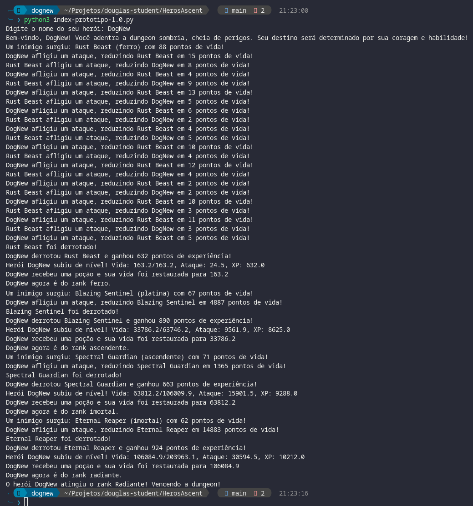
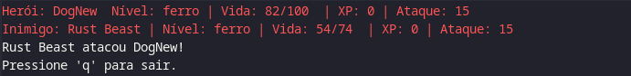

# HerosAscent
Hero's Ascent (Ascensão do Herói)

## Desafio DIO - Digital Innovation One

Curso: [GFT Start #6 - Lógica de Programação](https://web.dio.me/track/gft-start-logica-de-programacao)

###Instruções para entrega
#### 1️⃣ Desafio Classificador de nível de Herói

**O Que deve ser utilizado**

- Variáveis
- Operadores
- Laços de repetição
- Estruturas de decisões

### Objetivo

Crie uma variável para armazenar o nome e a quantidade de experiência (XP) de um herói, depois utilize uma estrutura de decisão para apresentar alguma das mensagens abaixo:

Se XP for menor do que 1.000 = Ferro
Se XP for entre 1.001 e 2.000 = Bronze
Se XP for entre 2.001 e 5.000 = Prata
Se XP for entre 5.001 e 7.000 = Ouro
Se XP for entre 7.001 e 8.000 = Platina
Se XP for entre 8.001 e 9.000 = Ascendente
Se XP for entre 9.001 e 10.000= Imortal
Se XP for maior ou igual a 10.001 = Radiante

### Saída

Ao final deve se exibir uma mensagem:
"O Herói de nome **{nome}** está no nível de **{nivel}**"

## Desafio - SOLUÇÃO

Um simulador de um game utilizando python.


### Versão 1.0 - Protótipo



```python
import random

# Lista de ranks
ranks = ["ferro", "bronze", "prata", "ouro", "platina", "ascendente", "imortal", "radiante"]

# Lista de nomes de monstros para cada rank
rank_monsters = {
    "ferro": ["Iron Golem", "Rust Beast", "Scrap Gargoyle", "Metallic Spider", "Corroded Hulk"],
    "bronze": ["Bronze Minotaur", "Copper Serpent", "Burnished Harpy", "Gleaming Wight", "Polished Fiend"],
    "prata": ["Silver Knight", "Platinum Wraith", "Moonlit Specter", "Shimmering Wyvern", "Celestial Djinn"],
    "ouro": ["Golden Dragon", "Auric Chimera", "Gilded Lich", "Radiant Behemoth", "Solar Hydra"],
    "platina": ["Platinum Leviathan", "Shining Archon", "Chrome Kraken", "Blazing Sentinel", "Crystal Drake"],
    "ascendente": ["Ascended Phantom", "Ethereal Watcher", "Spectral Guardian", "Void Stalker", "Stellar Beast"],
    "imortal": ["Immortal Titan", "Eternal Reaper", "Timeless Leviathan", "Unyielding Warden", "Boundless Fiend"],
    "radiante": ["Radiant Phoenix", "Divine Seraph", "Luminous Leviathan", "Celestial Titan", "Eclipse Dragon"]
}

# Classe base para os personagens
class Personagem:
    def __init__(self, nome, tipo, vida, xp, ataque, nivel):
        self.nome = nome
        self.tipo = tipo  # Pode ser 'heroi' ou 'inimigo'
        self.vida = vida
        self.max_vida = vida
        self.xp = xp
        self.ataque = ataque
        self.nivel = nivel  # Indica o rank atual do personagem

# Subclasse para o herói
class Heroi(Personagem):
    def __init__(self, nome):
        super().__init__(nome, "heroi", vida=100, xp=0, ataque=15, nivel="ferro")

    # Método para aumentar os atributos ao subir de nível
    def subir_nivel(self, xp_ganho):
        up_nivel = 1 + (xp_ganho / 1000)
        self.xp += xp_ganho
        self.vida = self.max_vida  # Restaura a vida ao máximo
        self.max_vida *= up_nivel
        self.ataque *= up_nivel
        
        # Poção de vida ao derrotar inimigo
        pocao = random.randint(10, 100)
        self.vida = min(self.vida + pocao, self.max_vida)
        print(
            f"Herói {self.nome} subiu de nível! Vida: {self.vida:.1f}/{self.max_vida:.1f}, "
            f"Ataque: {self.ataque:.1f}, XP: {self.xp:.1f}"
        )
        print(f"{self.nome} recebeu uma poção e sua vida foi restaurada para {self.vida:.1f}")


# Função para gerar um inimigo aleatório com base no nível do herói
def gerar_inimigo(nivel):
    nome_inimigo = random.choice(rank_monsters[nivel])
    vida = random.randint(50, 100)
    ataque = random.randint(10, 20)
    return Personagem(nome_inimigo, "inimigo", vida, 0, ataque, nivel)

# Função de ataque
def realizar_ataque(atacante, defensor):
    dano = round(random.uniform(0.1, 1) * atacante.ataque)
    defensor.vida -= dano
    print(f"{atacante.nome} afligiu um ataque, reduzindo {defensor.nome} em {dano} pontos de vida!")
    if defensor.vida <= 0:
        print(f"{defensor.nome} foi derrotado!")

# Função para calcular o nível do herói com base no XP
def atualizar_nivel_heroi(heroi):
    xp = heroi.xp
    if xp < 1000:
        heroi.nivel = "ferro"
    elif 1000 <= xp < 2000:
        heroi.nivel = "bronze"
    elif 2000 <= xp < 5000:
        heroi.nivel = "prata"
    elif 5000 <= xp < 7000:
        heroi.nivel = "ouro"
    elif 7000 <= xp < 8000:
        heroi.nivel = "platina"
    elif 8000 <= xp < 9000:
        heroi.nivel = "ascendente"
    elif 9000 <= xp < 10000:
        heroi.nivel = "imortal"
    else:
        heroi.nivel = "radiante"

# Ciclo de combate
def combate(heroi):
    while heroi.nivel != "radiante" and heroi.vida > 0:
        # Gerar inimigo com base no nível do herói
        inimigo = gerar_inimigo(heroi.nivel)
        print(f"Um inimigo surgiu: {inimigo.nome} ({inimigo.nivel}) com {inimigo.vida} pontos de vida!")

        # Combate até a derrota de um dos personagens
        while heroi.vida > 0 and inimigo.vida > 0:
            realizar_ataque(heroi, inimigo)
            if inimigo.vida > 0:
                realizar_ataque(inimigo, heroi)

        # Se o herói venceu o inimigo
        if heroi.vida > 0:
            xp_ganho = random.randint(500, 1000)
            print(f"{heroi.nome} derrotou {inimigo.nome} e ganhou {xp_ganho} pontos de experiência!")
            heroi.subir_nivel(xp_ganho)
            atualizar_nivel_heroi(heroi)
            print(f"{heroi.nome} agora é do rank {heroi.nivel}.")
        else:
            print(f"{heroi.nome} foi derrotado na dungeon! Fim de jogo.")
            return

    if heroi.nivel == "radiante":
        print(f"O herói {heroi.nome} atingiu o rank Radiante! Vencendo a dungeon!")

# Configuração do herói com input do usuário
nome_heroi = input("Digite o nome do seu herói: ")
heroi = Heroi(nome_heroi)

# Introdução
introducao = (
    f"Bem-vindo, {heroi.nome}! Você adentra a dungeon sombria, cheia de perigos. "
    "Seu destino será determinado por sua coragem e habilidade!"
)

print(introducao)

# Inicia o combate
combate(heroi)

```

### Versão 2.0 - Com Biblioteca Curses



```python
import curses
import random
import time

# Lista de ranks
ranks = ["ferro", "bronze", "prata", "ouro", "platina", "ascendente", "imortal", "radiante"]

# Lista de nomes de monstros para cada rank
rank_monsters = {
    "ferro": ["Iron Golem", "Rust Beast", "Scrap Gargoyle", "Metallic Spider", "Corroded Hulk"],
    "bronze": ["Bronze Minotaur", "Copper Serpent", "Burnished Harpy", "Gleaming Wight", "Polished Fiend"],
    "prata": ["Silver Knight", "Platinum Wraith", "Moonlit Specter", "Shimmering Wyvern", "Celestial Djinn"],
    "ouro": ["Golden Dragon", "Auric Chimera", "Gilded Lich", "Radiant Behemoth", "Solar Hydra"],
    "platina": ["Platinum Leviathan", "Shining Archon", "Chrome Kraken", "Blazing Sentinel", "Crystal Drake"],
    "ascendente": ["Ascended Phantom", "Ethereal Watcher", "Spectral Guardian", "Void Stalker", "Stellar Beast"],
    "imortal": ["Immortal Titan", "Eternal Reaper", "Timeless Leviathan", "Unyielding Warden", "Boundless Fiend"],
    "radiante": ["Radiant Phoenix", "Divine Seraph", "Luminous Leviathan", "Celestial Titan", "Eclipse Dragon"]
}

class Personagem:
    def __init__(self, nome, tipo, vida, xp, ataque, nivel):
        self.nome = nome
        self.tipo = tipo
        self.vida = vida
        self.max_vida = vida
        self.xp = xp
        self.ataque = ataque
        self.nivel = nivel

class Heroi(Personagem):
    def __init__(self, nome):
        super().__init__(nome, "heroi", vida=100, xp=0, ataque=15, nivel="ferro")

    def subir_nivel(self, xp_ganho):
        up_nivel = 1 + (xp_ganho / 1000)
        self.xp += int(xp_ganho)
        self.vida = self.max_vida
        self.max_vida = int(self.max_vida * up_nivel)
        self.ataque = int(self.ataque * up_nivel)
        pocao = random.randint(10, 100)
        self.vida = min(self.vida + pocao, self.max_vida)

def gerar_inimigo(nivel):
    nome_inimigo = random.choice(rank_monsters[nivel])
    vida = random.randint(50, 100)
    ataque = random.randint(10, 20)
    return Personagem(nome_inimigo, "inimigo", vida, 0, ataque, nivel)

def realizar_ataque(atacante, defensor, msg_func):
    dano = int(round(random.uniform(0.1, 1) * atacante.ataque))
    defensor.vida -= dano
    msg_func(f"{atacante.nome} afligiu {dano} de dano em {defensor.nome}!")
    if defensor.vida <= 0:
        msg_func(f"{defensor.nome} foi derrotado!")

def atualizar_nivel_heroi(heroi):
    xp = heroi.xp
    if xp < 1000:
        heroi.nivel = "ferro"
    elif 1000 <= xp < 2000:
        heroi.nivel = "bronze"
    elif 2000 <= xp < 5000:
        heroi.nivel = "prata"
    elif 5000 <= xp < 7000:
        heroi.nivel = "ouro"
    elif 7000 <= xp < 8000:
        heroi.nivel = "platina"
    elif 8000 <= xp < 9000:
        heroi.nivel = "ascendente"
    elif 9000 <= xp < 10000:
        heroi.nivel = "imortal"
    else:
        heroi.nivel = "radiante"

def captura_nome_heroi(stdscr):
    curses.curs_set(1)  # Habilita o cursor
    stdscr.clear()
    stdscr.addstr(0, 0, "Digite o nome do seu herói: ")
    stdscr.refresh()
    nome_heroi = ""
    while True:
        key = stdscr.getch()
        if key == 10:  # Enter
            break
        elif key == 27:  # Esc
            break
        elif key == 8:  # Backspace
            nome_heroi = nome_heroi[:-1]
        else:
            nome_heroi += chr(key)
        stdscr.clear()
        stdscr.addstr(0, 0, "Digite o nome do seu herói: " + nome_heroi)
        stdscr.refresh()
    return nome_heroi

def exibir_status(stdscr, heroi, inimigo, linha_status, linha_ataques):
    curses.init_pair(1, curses.COLOR_RED, curses.COLOR_BLACK)
    curses.init_pair(2, curses.COLOR_BLACK, curses.COLOR_WHITE)

    # Limpar as linhas antes de exibir as novas informações
    stdscr.clear()

    # Primeira linha: Status do herói
    if heroi.vida < heroi.max_vida:
        stdscr.addstr(0, 0, f"Herói: {heroi.nome}  Nível: {heroi.nivel} | Vida: {heroi.vida}/{heroi.max_vida}  | XP: {heroi.xp} | Ataque: {heroi.ataque}", curses.color_pair(1))
    else:
        stdscr.addstr(0, 0, f"Herói: {heroi.nome}  Nível: {heroi.nivel} | Vida: {heroi.vida}/{heroi.max_vida}  | XP: {heroi.xp} | Ataque: {heroi.ataque}")

    # Segunda linha: Status do inimigo
    if inimigo.vida < inimigo.max_vida:
        stdscr.addstr(1, 0, f"Inimigo: {inimigo.nome} | Nível: {inimigo.nivel} | Vida: {inimigo.vida}/{inimigo.max_vida}  | XP: {inimigo.xp} | Ataque: {inimigo.ataque}", curses.color_pair(1))
    else:
        stdscr.addstr(1, 0, f"Inimigo: {inimigo.nome} | Nível: {inimigo.nivel} | Vida: {inimigo.vida}/{inimigo.max_vida}  | XP: {inimigo.xp} | Ataque: {inimigo.ataque}")

    # Terceira linha: Mensagem de ataque ou resultado de combate
    stdscr.addstr(2, 0, linha_ataques)
    
    # Quarta linha: Mensagens do sistema
    stdscr.addstr(3, 0, "Pressione 'q' para sair.")

    stdscr.refresh()

def combate_curses(stdscr, heroi):
    curses.curs_set(0)
    stdscr.clear()

    # Configuração de cores
    curses.start_color()
    curses.init_pair(1, curses.COLOR_RED, curses.COLOR_BLACK)
    curses.init_pair(2, curses.COLOR_BLACK, curses.COLOR_WHITE)
    curses.init_pair(3, curses.COLOR_GREEN, curses.COLOR_BLACK)
    curses.init_pair(4, curses.COLOR_BLACK, curses.COLOR_YELLOW)

    def exibir_mensagem(msg, special=False):
        stdscr.addstr(2, 0, msg)
        stdscr.refresh()

    introducao = (
        f"Bem-vindo, {heroi.nome}! Você adentra a dungeon sombria, cheia de perigos. "
        "Seu destino será determinado por sua coragem e habilidade!"
    )
    exibir_mensagem(introducao)
    time.sleep(5)

    while heroi.nivel != "radiante" and heroi.vida > 0:
        inimigo = gerar_inimigo(heroi.nivel)
        linha_status = "Inimigo apareceu!"
        exibir_status(stdscr, heroi, inimigo, linha_status, f"O inimigo {inimigo.nome} se aproxima!")

        while heroi.vida > 0 and inimigo.vida > 0:
            realizar_ataque(heroi, inimigo, exibir_mensagem)
            exibir_status(stdscr, heroi, inimigo, linha_status, f"{heroi.nome} atacou {inimigo.nome}!")
            time.sleep(3)
            if inimigo.vida > 0:
                realizar_ataque(inimigo, heroi, exibir_mensagem)
                exibir_status(stdscr, heroi, inimigo, linha_status, f"{inimigo.nome} atacou {heroi.nome}!")
                time.sleep(3)

        if heroi.vida > 0:
            heroi.subir_nivel(random.randint(500, 1500))
            atualizar_nivel_heroi(heroi)

            # Verificar se o herói atingiu o rank radiante e mostrar mensagem de vitória
            if heroi.nivel == "radiante":
                linha_status = f"{heroi.nome} atingiu o rank Radiante! Vencendo a dungeon!"
                exibir_status(stdscr, heroi, inimigo, linha_status, linha_status)  # Atualizar a tela com a nova mensagem
                time.sleep(5)  # Pausar um pouco para exibir a mensagem
                break  # Finaliza o jogo, ou pode ser substituído por outro comportamento desejado
        else:
            exibir_mensagem(f"{heroi.nome} foi derrotado no nível {heroi.nivel}!")
            break

    exibir_mensagem("Fim de jogo!", special=True)
    stdscr.refresh()
    stdscr.getch()

if __name__ == "__main__":
    nome_heroi = captura_nome_heroi(curses.initscr())
    heroi = Heroi(nome_heroi)
    curses.wrapper(combate_curses, heroi)

```